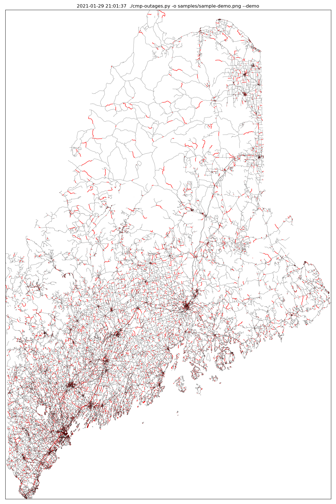

# CMP Outage Map Generator

A script to create a map with outage information from the Central Maine Power website.



### Prerequisites

This script requires python3 and, due to a bug in [virtualenv](https://github.com/pypa/virtualenv/issues/54), you may need to make your virtual environment using [venv](https://docs.python.org/3/library/venv.html).

```
python3 -m venv /path/to/new/virtual/environment

source /path/to/new/virtual/environment/bin/activate

pip install -r requirements.txt
```

For more details, see [the matplotlib page about this issue](http://matplotlib.org/faq/osx_framework.html#virtualenv).

## Running the script

Without arguements, ``python3 cmp-outages.py`` will generate a map of the current outages, zoomed to just show them.

If there are no active outages, ``python3 cmp-outages.py --demo`` will paint 10% of the state red.

To show the entire state:

``python3 cmp-outages.py --entirestate``

To limit zoom to a specific town or towns, instead: 

``python3 cmp-outages.py --zoom Augusta --zoom Portland``

To highlight a specific town or towns so that they're easier to spot:

``python3 cmp-outages.pl --interesting Augusta --interesting Portland``

Use ``python3 cmp-outages.py --help `` for full options, including output selection.

## Built With

* [BeautifulSoup](https://www.crummy.com/software/BeautifulSoup/bs4/doc/) - Quick and easy web scraping
* [pyshp](https://github.com/GeospatialPython/pyshp) - GIS shapefile parsing
* [tqdm](https://github.com/tqdm/tqdm) - Pretty progress bars
* [Matplotlib](http://matplotlib.org/index.html) - Charts and graphs

## Thanks To

* Todd Metzler, for his [Maine E911 NG Roads](https://geolibrary-maine.opendata.arcgis.com/datasets/9427831815c34f9294959c673342e1c2_1) dataset
* Central Maine Power, for their [outages page](http://www.cmpco.com/outages/outageinformation.html), which has provided a ray of hope during many a blackout

## Contributing

Open an issue in the github issue tracker or send me a pull request and I'll be happy to take a look.

## Authors

* **Luke Hankins** - [lukehankins](https://github.com/lukehankins)

## License

This project is licensed under the MIT License - see the [LICENSE.md](LICENSE.md) file for details

